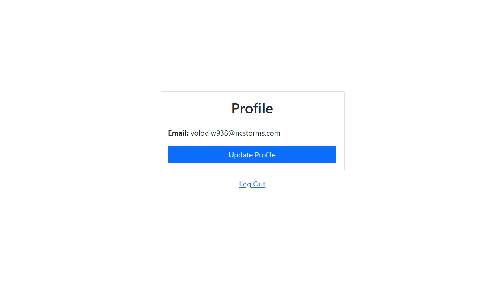

<h1 align='center'>Firebase Authentication React</h1>
<h2 align='center'><a href="" >DEMO</a></h2>

## 🎯 Lessons Learned:

- Used FIREBASE for Authentication (`npm i firebase`)
- Used React Hooks : `useState` `useContext` `useEffect` and Custom Hooks
- Used React Router : `BrowserRouter` `Route` `Switch` `Link` `useHistory` `Redirect` `PrivateRoute`
- Used BOOTSTRAP for Styling (`npm i bootstrap react-bootstrap`)
